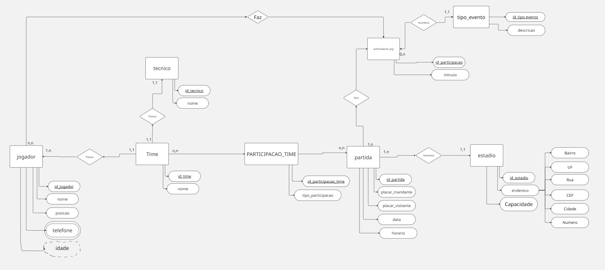
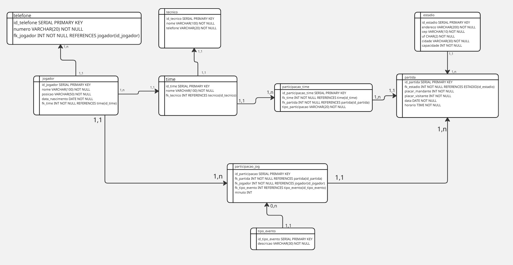
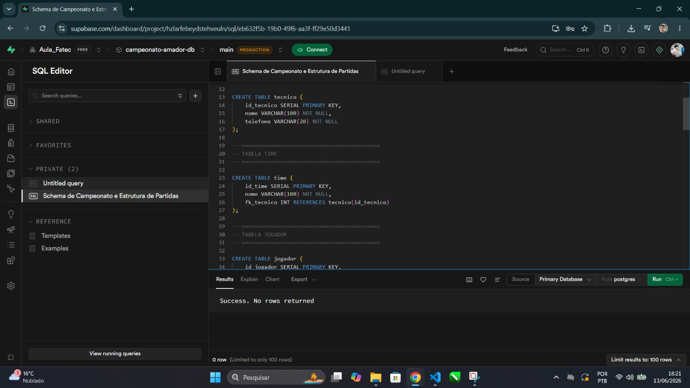
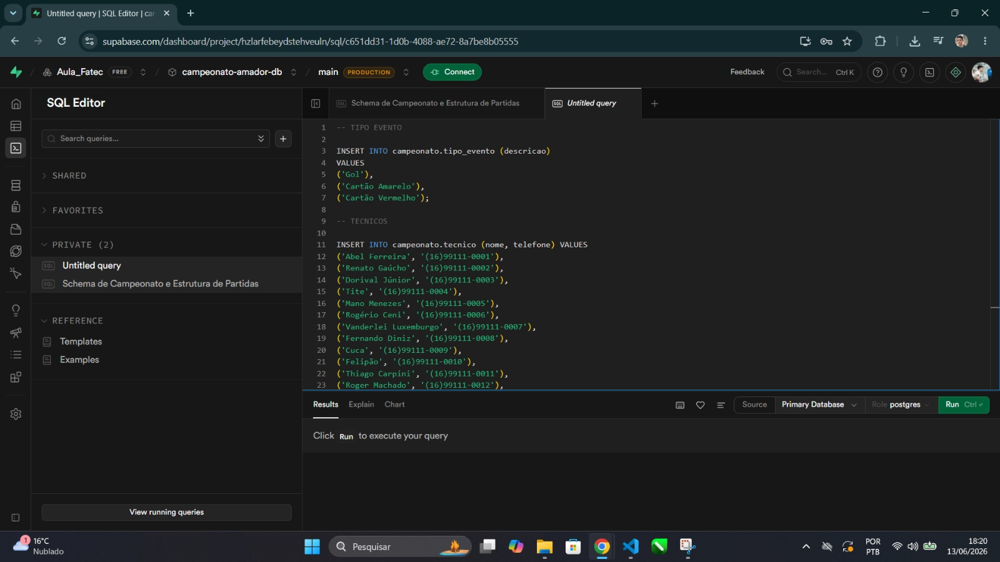
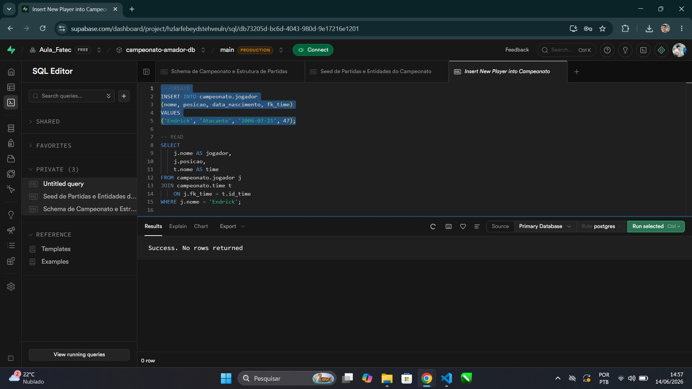
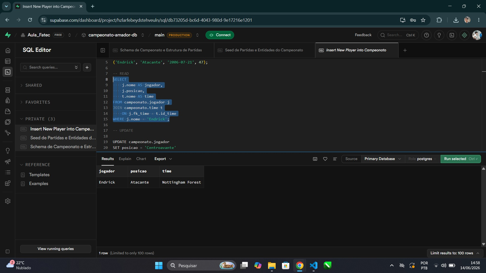
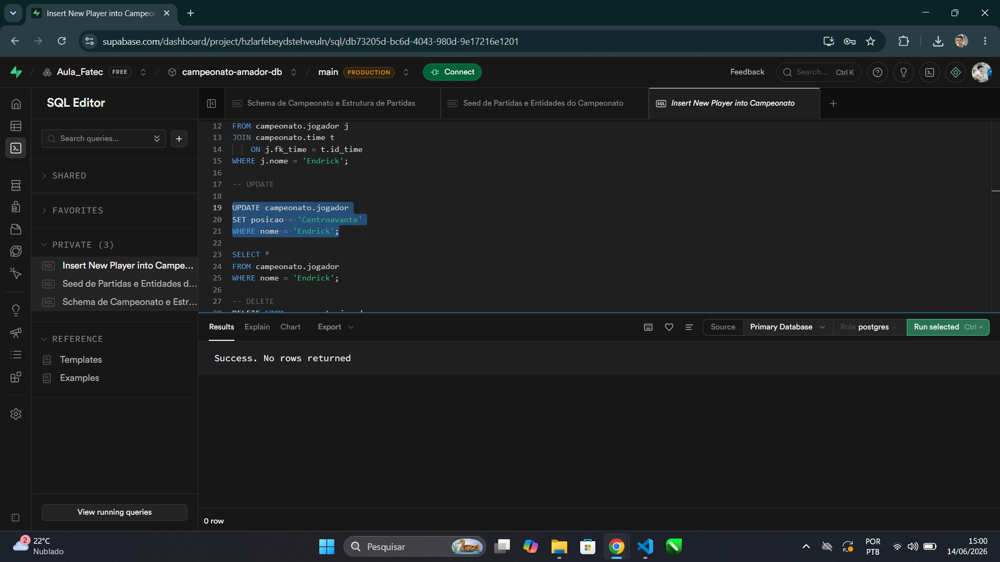
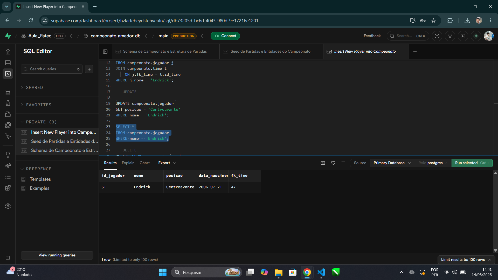
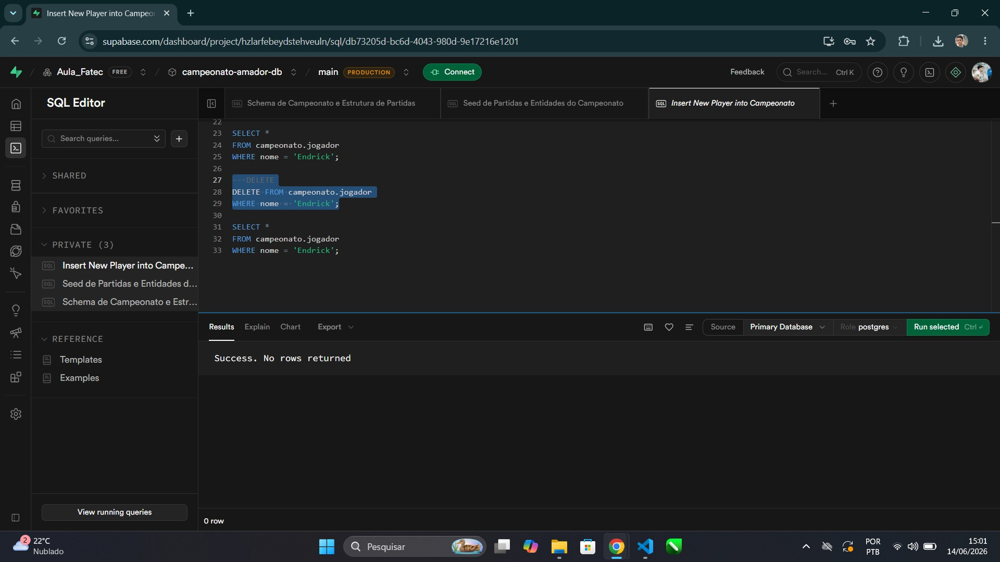
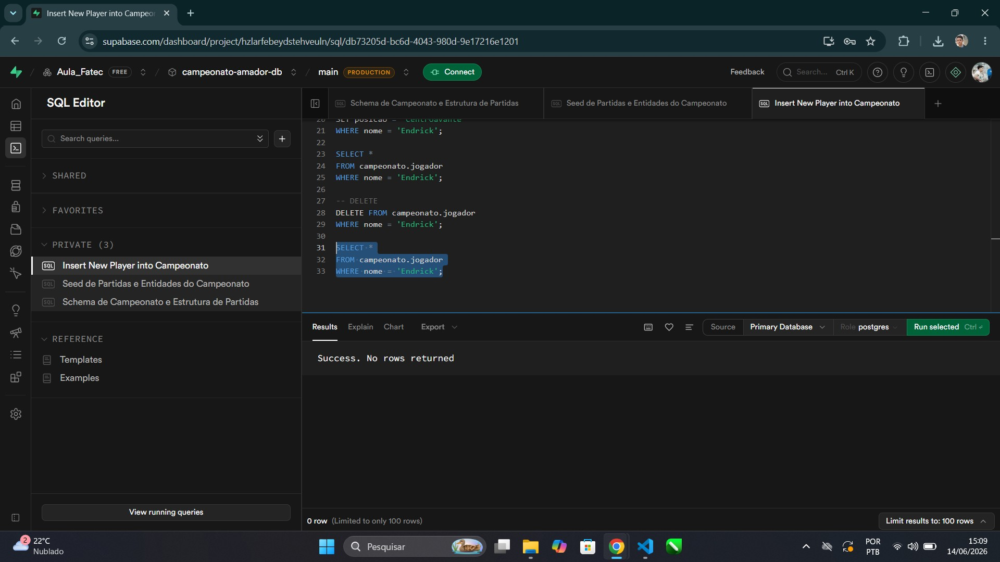

# Sistema de Campeonato Amador

Projeto desenvolvido para a disciplina de Banco de Dados, com o objetivo de modelar, implementar e manipular um banco de dados responsável pelo gerenciamento de um campeonato de futebol amador.

---

# Cenário

Uma liga de futebol amador busca modernizar o gerenciamento de suas competições por meio de um sistema capaz de centralizar as principais informações do campeonato. Atualmente, o controle é realizado de forma manual, dificultando o acompanhamento das equipes, dos profissionais envolvidos, dos atletas e dos resultados das partidas.

Para solucionar esse problema, foi proposto um banco de dados que organize o cadastro das equipes, de seus respectivos técnicos e dos jogadores, mantendo também informações sobre os estádios onde as partidas são realizadas e o calendário da competição.

Durante cada jogo, o sistema registra acontecimentos importantes, como gols e cartões, permitindo acompanhar o desempenho individual dos jogadores e das equipes ao longo do campeonato. Além disso, a associação entre técnicos, times, atletas e partidas possibilita uma visão completa da competição e facilita a consulta das informações armazenadas.

Com os dados estruturados e integrados, torna-se possível gerar relatórios estatísticos, identificar artilheiros, equipes com melhor desempenho, jogadores com maior número de cartões e diversas outras informações relevantes para a administração do campeonato. Dessa forma, o projeto oferece uma solução organizada, confiável e eficiente para o gerenciamento de todas as etapas da competição.

---

# Modelagem Conceitual

A modelagem conceitual foi desenvolvida utilizando o Modelo Entidade-Relacionamento (MER), identificando todas as entidades, atributos e relacionamentos necessários para representar o cenário proposto.

## DER

    

---

# Modelagem Lógica

Após a modelagem conceitual, foi elaborado o modelo lógico contendo as tabelas, atributos, chaves primárias e chaves estrangeiras que compõem o banco de dados.

## Modelo Lógico

    

---

# Modelagem Física

A implementação foi realizada utilizando PostgreSQL, criando um schema denominado **campeonato**.

Foram definidas todas as tabelas, seus tipos de dados, chaves primárias, chaves estrangeiras e relacionamentos.

## Criação das tabelas

    

## Inserção dos dados

    

Foram inseridos registros para:

- 50 Técnicos
- 50 Times
- 50 Jogadores
- 50 Telefones
- 50 Estádios
- 50 Partidas
- 100 Participações dos Times
- 150 Eventos dos Jogadores
- 3 Tipos de Eventos

---

# CRUD

## CREATE

Inserção de novos registros no banco de dados.

    

---

## READ

Consulta de informações utilizando relacionamentos entre as tabelas.

    

---

## UPDATE

Atualização de registros existentes.

    

### Verificação da atualização

    

---

## DELETE

Exclusão de registros do banco de dados.

    

### Verificação da exclusão

    

---

# Relatórios

Foram desenvolvidas consultas SQL utilizando SELECT, JOIN, WHERE, GROUP BY e ORDER BY, demonstrando os relacionamentos entre as tabelas e a extração de informações relevantes do campeonato.

## Artilheiro do campeonato

    

---

## Jogador que recebeu mais cartões

    

---

## Time com mais gols marcados

    

---

## Time com mais vitórias

    

---

## Partidas com mais gols

    

---

## Jogadores do Liverpool

    

---

## Estádios com capacidade superior a 50 mil pessoas

    

---

## Quantidade de jogadores por posição

    

---

## Quantidade de jogadores por time

    

---

## Todos os eventos da partida 1

    

---

# Tecnologias Utilizadas

- PostgreSQL
- Supabase
- GitHub

---

# Conclusão

O projeto permitiu aplicar os conceitos de modelagem conceitual, lógica e física de banco de dados, além da utilização de chaves primárias, chaves estrangeiras, relacionamentos, normalização e consultas SQL.

Também foram implementadas operações CRUD e relatórios estatísticos que demonstram a utilização prática do banco de dados em um cenário de gerenciamento de campeonatos de futebol amador.
